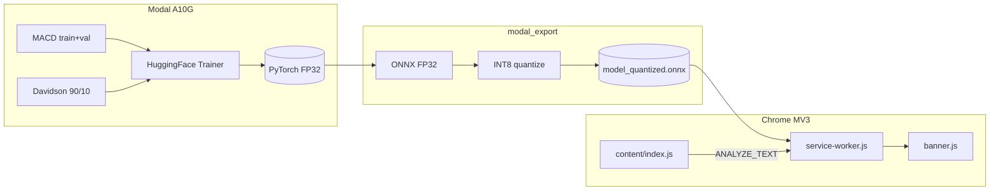

# SurakshaNet — BTP End-Semester Presentation (**FINAL — single source of truth**)

This is the **full** deck script for your BTP defence (Slides **1–34** + appendices).

**Notebook LM / 15-slide limit:** use the split files instead of this single file:

| File | Contents |
|------|----------|
| **`REPORTS/BTP_PRESENTATION_FINAL_PART_A.md`** | Slides **1–15** (exactly 15) |
| **`REPORTS/BTP_PRESENTATION_FINAL_PART_B.md`** | Slides **16–34** + appendices — if still too long, run Notebook LM on **slides 16–30** first, then **31–34 + appendices** |

---

## Numerics rule

- Use **MobiSys poster / pipeline figure** values everywhere **except** **Slide 14 (quantization table)** — those rows come only from **`REPORTS/final_report.md`**: **−0.28 percentage points** (84.66% → 84.38%). **Do not** use the poster’s **“<0.11%”** on slides.
- **Training row count:** Modal logs show **42,488** combined train rows; poster often cites **42,487** — either is fine; prefer **42,488** when showing the Modal screenshot slide.

---

## Complete graphics index (every asset in one place)

| Slide(s) | Asset | Role |
|----------|-------|------|
| **7** | `REPORTS/paper2.png` | Five-stage pipeline (full slide) |
| **10** | `REPORTS/loss_curves.png` | Train/val loss |
| **13** | `REPORTS/confusion_matrices.png` | 3×3 models × tests |
| **15** | `REPORTS/paper1.jpeg` | Live WhatsApp UI demo |
| **18** | *(optional)* HotCRP acceptance email screenshot | MobiSys acceptance |
| **26** | `REPORTS/WhatsApp Image 2026-05-10 at 14.58.41.jpeg` | Modal dataset construction logs |
| **27** | `REPORTS/WhatsApp Image 2026-05-10 at 15.00.32.jpeg` | Epoch-2 validation metrics (terminal) |
| **28** | `REPORTS/WhatsApp Image 2026-05-10 at 15.12.38.jpeg` | FP32 `size_pt` — MB + parameter count |
| *(build)* | Bar charts in PPT | Sizes 471→113, 86.34 vs 84.66, latency |

---

## Master layout defaults

- **Slide size:** 16:9 · **Margins:** ~5% L/R · **Title:** 28–32 pt bold · **Body:** 18–22 pt · **≤5 bullets/slide** unless noted · **Figures:** proportional, centered.

---

# SLIDES 1–21 — Story, results, demo

## Slide 1 — Title

**Layout:** Title upper-middle; subtitle; names bottom-center.

**Title:**

```
SurakshaNet
```

**Subtitle line 1:**

```
Privacy-First, Edge-Deployed Multilingual Abusive Language Detection
```

**Subtitle line 2:**

```
B.Tech Project — End-Semester Evaluation · Computer Science & Engineering · IIT Ropar
```

**Names:**

```
Aamod Jain · Pratham Garg · Dr. Geeta Yadav
```

**Graphic:** Optional IIT Ropar + Chrome logos.

---

## Slide 2 — Agenda

**Title:** `Outline`

**Bullets:**

```
• Mid-semester recap vs end-semester objectives
• Problem statement & contributions
• End-to-end pipeline (datasets → edge deployment → inference → forensics)
• Training setup & evaluation integrity (held-out tests, zero leakage)
• Results — accuracy vs MACD paper; multilingual headline; compression & quantization
• Runtime performance & live deployment
• Technical depth — validation design, Modal logs, export chain, browser call graph
• MobiSys ’26 poster acceptance
• Limitations, conclusion, Q&A
```

---

## Slide 3 — Mid-semester recap

**Title:** `Mid-Semester Recap`

**Bullets:**

```
• Chrome extension (Manifest V3): monitored DOM on WhatsApp Web / similar web apps
• Inline alert banners injected next to toxic message nodes
• Toxicity model: generic off-the-shelf classifier (not trained on MACD)
• Direction set: privacy-first, on-device inference; groundwork for evidence logging
```

---

## Slide 4 — End-semester objectives vs delivered

**Title:** `End-Semester Objectives → Delivered`

**Headers:** `Objective` | `Delivered`

| Objective | Delivered |
|-----------|-----------|
| Train on MACD-aligned Hindi + English data | MACD Hindi + Davidson English combined; **42,488** training rows (Modal logs); deterministic Davidson 90/10 split |
| Replace generic toxicity detector | Fine-tuned **`sentence-transformers/paraphrase-multilingual-MiniLM-L12-v2`** |
| Browser-deployable model | **INT8 ONNX** + **onnxruntime-web** / WASM in MV3 **service worker**; shipped artifact **~113 MB** |
| Rigorous evaluation | Held-out **Test A / B / C**; **zero** train↔test text overlap (hash checks) |
| Academic dissemination | **MobiSys ’26 Posters** acceptance (ACM) |

**Graphic:** Horizontal timeline — Mid-sem prototype → MACD MiniLM + benchmarks → INT8 + MobiSys.

---

## Slide 5 — Problem & motivation

**Title:** `Problem & Motivation`

**Bullets:**

```
• Gender-based harassment is prevalent in code-mixed Hinglish / Hindi online contexts
• Cloud moderation APIs: privacy exposure, latency, user content leaves the device
• Requirement: real-time detection inside the browser without uploading raw chats
• Goal: multilingual abuse classification plus locally auditable, forensic-grade incident artifacts
```

**Graphic:** Cloud + slash → laptop + padlock (~30% width).

---

## Slide 6 — Contributions

**Title:** `Contributions`

**Bullets:**

```
(1) Chrome extension prototype for in-browser abuse detection on live web messaging UIs
(2) Training pipeline: ShareChat MACD (Hindi/Hinglish) + Davidson English → unified binary labels
(3) Aggressive compression (INT8 ONNX) + WASM inference + forensic evidence & reporting stack
```

---

## Slide 7 — Full pipeline figure (`paper2.png`)

**Title:** `SurakshaNet — End-to-End Pipeline`

**Subtitle (~18 pt):**

```
Multilingual data → MiniLM training & INT8 quantization → Chrome extension → live classification → forensic reporting
```

**Main graphic:** **`REPORTS/paper2.png`** — ~92% width, ~70–75% slide height; do not crop five stages.

**Footer caption (14–16 pt, grey):**

```
Figure: Five-stage pipeline — dataset fusion (MACD + Davidson, 42k+ instances) → Modal A10G training & 76% size reduction (471 MB → 113 MB) → MV3 + WASM (~89 MB RAM, 28 ms median) → MutationObserver + SHIELD tiers → AES-256 & court-admissible PDF workflow.
```

**Speaker note:** If figure says “Interference”, say **“Inference”** aloud.

---

## Slide 8 — Datasets & splits

**Title:** `Datasets & Evaluation Splits`

**Table:**

| Source | Split used in project | Held-out test size |
|--------|----------------------|-------------------|
| **ShareChat MACD** | `hindi_train` / `hindi_val` / **`hindi_test`** | **6,728** |
| **Davidson et al. 2017** | 90% train · **10% deterministic holdout** (`seed = 42`) | **2,478** |
| **Combined stress test** | Tests concatenated | **9,206** |

**Footnote:**

```
Training uses MACD hindi_val for checkpoint selection only. hindi_test is never used during training. Davidson 3-class labels mapped to MACD-binary abusive / non-abusive.
```

---

## Slide 9 — Evaluation integrity

**Title:** `Evaluation Integrity — Train/Test Leakage`

**Table:**

| Test set | **N** | Rows overlapping training texts |
|----------|------:|--------------------------------:|
| MACD `hindi_test` | **6,728** | **0** |
| Davidson 10% holdout | **2,478** | **0** |
| Combined | **9,206** | **0** |

**Line below:**

```
Every test row’s text is hashed and checked against the full training-text set before any metric is computed.
```

---

## Slide 10 — Training configuration + loss curves

**Title:** `Training Configuration`

**Left (~45%):**

```
• Base model: paraphrase-multilingual-MiniLM-L12-v2
• Modal **A10G** GPU training
• **7** epochs · batch **32** · lr **3×10⁻⁵** · cosine schedule · **10%** warmup
• Label smoothing **0.1** · **balanced class weights** · checkpoint selected by **macro-F1** on validation
```

**Right (~52%):** **`REPORTS/loss_curves.png`** — ~65–70% slide height, top-aligned.

---

## Slide 11 — Hindi-only vs MACD paper

**Title:** `Hindi-Only Held-Out Test — Comparison to Published MACD Baseline`

**Table:**

| Metric | Value |
|--------|------:|
| **MACD paper** — XLM-R, Hindi test | **86.34%** accuracy |
| **SurakshaNet** — Test A (`hindi_test`), FP32 | **84.66%** accuracy |
| **Gap (poster)** | **−1.68%** |

**Note box:**

```
Interpretation: −1.68% = −1.68 percentage points (86.34 − 84.66).
Design: MiniLM fits browser WASM constraints; XLM-R-scale models impractical for edge RAM (poster rationale).
```

**Graphic:** Two bars **86.34** vs **84.66**.

---

## Slide 12 — Multilingual headline (poster)

**Title:** `Hindi + English Combined Setting (Poster Headline)`

**Large centre:**

```
88.01%
```

**Below:**

```
Accuracy — SurakshaNet, Hindi + English (poster reported)
```

**Small note:**

```
MACD paper does not report a comparable English-inclusive single-number baseline for this combined setting (poster wording).
```

---

## Slide 13 — Confusion matrices

**Title:** `Confusion Matrices — Held-Out Tests`

**Subtitle:**

```
Rows = true label · Columns = predicted · Classes: abusive / non-abusive · Models: PT / ONNX FP32 / INT8 · Tests: A · B · C
```

**Graphic:** **`REPORTS/confusion_matrices.png`** — full width, ~78% height.

---

## Slide 14 — Compression & quantization

**Title:** `Compression & Quantization Impact`

**Two equal panels.**

**Left — heading:** `Model size (poster / pipeline figure)`

```
471 MB  →  113 MB
76% reduction
```

Mini horizontal bars + **76% SIZE REDUCTION**.

**Right — heading:** `Accuracy impact of INT8 quantization — Test A only (measured, REPORTS)`

| | Accuracy | Macro F1 |
|---|----------|----------|
| **Before INT8 (FP32)** | **84.66%** | **84.66%** |
| **After INT8** | **84.38%** | **84.38%** |
| **Change** | **−0.28 percentage points** | **−0.28 percentage points** |

**Critical note:** `Use ONLY −0.28 pp — do not quote poster “<0.11%” here.`

---

## Slide 15 — Live deployment (`paper1.jpeg`)

**Title:** `Live Deployment — WhatsApp Web (Screenshot)`

**Graphic:** **`REPORTS/paper1.jpeg`** — full width, ~80% height.

**Caption:**

```
English abusive phrase + Hinglish threat → CRITICAL THREAT / HIGH · confidence (e.g. 95%) · benign Hindi unflagged · Block · Report · Save Evidence
```

---

## Slide 16 — Runtime performance (poster)

**Title:** `Runtime Performance on the Edge Stack`

**Callouts:**

```
28 ms          ~89 MB           INT8 ONNX
median         RAM footprint    WASM MV3
latency        (poster)
```

**Bullets:**

```
• Median inference latency **28 ms** (poster / deployment measurements)
• RAM footprint **~89 MB** (poster)
• Real-time classification without remote model download during inference
```

---

## Slide 17 — Forensic & privacy

**Title:** `Forensic Evidence & Privacy`

**Bullets:**

```
• DOM snapshots & millisecond-precision timestamps
• Chain-of-custody style logs for incident review
• **AES-256** local encryption of stored evidence
• Export path toward **court-admissible** incident reporting (PDF workflow)
• Raw chat content not uploaded for inference — weights ship inside the extension package
```

---

## Slide 18 — MobiSys acceptance

**Title:** `Peer Recognition`

**Bullets:**

```
• **MobiSys ’26 — Posters track** (ACM)
• Poster accepted — **Submission #19**
• Title: **Poster: SurakshaNet: Privacy-First, Edge-Deployed Multilingual Abusive Language Detection**
```

**Graphic:** HotCRP acceptance email — **right ~55%**; bullets **left ~42%**.

---

## Slide 19 — Limitations

**Title:** `Limitations & Ethics`

**Bullets:**

```
• Binary abusive vs non-abusive — severity grading not modeled
• Training-data bias & dialect coverage gaps may skew predictions
• Confidence percentage is model softmax output, not a legal judgment
• Continuous evaluation & user studies remain future work
```

---

## Slide 20 — Conclusion

**Title:** `Conclusion`

**Bullets:**

```
• MACD-aligned MiniLM pipeline with poster headline metrics (Hindi-only, Hindi+English, deployment figures)
• **76%** smaller weights (**471 MB → 113 MB**) with measured **−0.28 pp** Test-A drop after INT8 (REPORTS)
• MV3 extension + WASM inference + forensic hooks; **MobiSys ’26** poster acceptance
```

---

## Slide 21 — Thank you

**Title:** `Thank You`

```
Questions?

{your emails}

Repository / demo links as approved by your institute
```

---

# SLIDES 22–34 — Technical depth

## Slide 22 — What we implemented (engineering)

**Title:** `What We Implemented (End-to-End)`

**Body:**

```
• Cloud training (Modal A10G): PyTorch fine-tuning on MACD hindi_train + Davidson 90% train; validation ONLY on MACD hindi_val; hindi_test & Davidson 10% never used in modal_train.py.

• Export: FP32 ONNX → static INT8 quantization → tokenizer + config → assets/models/custom-macd-model/

• Browser: MV3 service worker loads INT8 ONNX via @xenova/transformers + ONNX Runtime Web (WASM); content script scans DOM → sendMessage → banner.js; evidence_logger for hashes/screenshots.
```

---

## Slide 23 — Base model

**Title:** `Base Model — sentence-transformers/paraphrase-multilingual-MiniLM-L12-v2`

**Bullets:**

```
• **BERT-style encoder** (12 layers, hidden 384) — MiniLM compact variant
• Pre-trained on **multilingual paraphrase / sentence** objectives — strong short-text representations
• Our head: **AutoModelForSequenceClassification**, **num_labels = 2**
• Loaded via **AutoTokenizer** + **AutoModelForSequenceClassification.from_pretrained** (`training/modal_train.py`)
```

**One-liner:**

```
XLM-R-class models score higher on MACD benchmarks but exceed browser WASM RAM; MiniLM is the deliberate accuracy–footprint trade-off (−1.68 pp vs paper on Hindi-only; ~76% smaller quantized bundle).
```

---

## Slide 24 — Training forward pass

**Title:** `Training-Time Forward Pass (Per Batch)`

**Numbered:**

```
1. Batch → WordPiece tokenizer → input_ids, attention_mask (max_length = 128).

2. MiniLM encoder → logits ∈ ℝ^{batch × 2}.

3. Loss = weighted CrossEntropyLoss(balanced class weights, label_smoothing = 0.1).

4. AdamW + cosine LR + 10% warmup (TrainingArguments).

5. Each epoch: eval on val_ds (**MACD hindi_val only**) — accuracy, macro-F1, precision, recall.
```

**Footnote:** `WeightedTrainer` subclasses Hugging Face `Trainer` (`training/modal_train.py`).

---

## Slide 25 — Validation semantics (critical)

**Title:** `Validation Set — What “Val” Means Here`

```
• Train = MACD hindi_train (20,183) + Davidson train (22,305) → **42,488** rows (shuffled).

• val_df = **macd_val only** — **6,728** rows, **Hindi MACD**.

• Davidson has **no** Trainer validation split — its 10% is **only** for modal_evaluate.py.

• metric_for_best_model = **f1_macro**, load_best_model_at_end = True.

→ Checkpoint selection optimizes **macro-F1 on Hindi validation**; English generalization appears on **held-out** Davidson Test B and combined Test C.
```

**Optional Q&A line:** “English is trained but not used for early-stopping validation.”

---

## Slide 26 — Modal dataset logs screenshot

**Title:** `Training Run — Dataset Construction (Modal Logs)`

**Layout:** Left **48%** bullets; Right **50%** screenshot.

**Numbers:**

```
MACD train:      20,183
MACD val:         6,728   ← Trainer eval_dataset
Davidson full:   24,783
Davidson train:  22,305 (90%)
Davidson test:    2,478 (10% — indices → /vol/davidson_test_indices.json)
Combined train:  42,488
Labels (train):  class 0 → 29,088 · class 1 → 13,400
```

**Graphic:** `REPORTS/WhatsApp Image 2026-05-10 at 14.58.41.jpeg`

**Caption:** `Fig.: surakshanet-train Modal logs — corpus sizes & Davidson index persistence.`

---

## Slide 27 — Epoch-2 validation screenshot

**Title:** `Training Dynamics — Validation Metrics (Example Epoch)`

**Layout:** Screenshot ~70% width.

**Numbers (Epoch 2 example):**

```
eval_loss ~0.407 · eval_accuracy ~0.845 · eval_f1_macro ~0.845 · epoch 2.0 · eval_runtime ~3.63 s · ~1853 samples/s
```

**Note box:**

```
These metrics are **MACD hindi_val during training**, NOT final **hindi_test (Test A)**. Final Test A FP32 accuracy = **84.66%** (`REPORTS/final_report.md`) after full training + evaluate pipeline.
```

**Graphic:** `REPORTS/WhatsApp Image 2026-05-10 at 15.00.32.jpeg`

---

## Slide 28 — FP32 size / parameters screenshot

**Title:** `Model Footprint Before Quantization (PyTorch FP32)`

```
model.safetensors · 448.839 MB · checkpoint dir 465.138 MB · 117,654,530 parameters (all trainable)
```

**Graphic:** `REPORTS/WhatsApp Image 2026-05-10 at 15.12.38.jpeg`

**Caption:** `FP32 artifact before ONNX export / INT8 (poster aggregate size story: 471 MB → 113 MB).`

---

## Slide 29 — Export pipeline

**Title:** `Export Pipeline (modal_export.py)`

**Numbered:**

```
1. Best checkpoint `/vol/checkpoints/pt`
2. Export → ONNX FP32 (~449 MB class per REPORTS)
3. Static INT8 quant → model_quantized.onnx (~113 MB)
4. Sync → `assets/models/custom-macd-model/`
5. `npm run build` → `dist/` extension
```

**Graphic:** Stage-2 bars from **`paper2.png`** or flowchart.

---

## Slide 30 — Browser call chain

**Title:** `Runtime Call Chain — Chrome Extension`

```
DOM mutation → MutationObserver (`src/content/index.js`) → scheduleScan [1200 ms throttle]
→ scanPage() → chrome.runtime.sendMessage({ type: 'ANALYZE_TEXT', text, source })
→ Service Worker (`service-worker.js`) → pipeline('text-classification','custom-macd-model')
→ ONNX Runtime Web WASM → analyzeToxicity() → sendResponse
→ showRedBanner (`banner.js`) → optional logIncident()
```

**Graphic:** Swimlanes (Page | Content script | Service worker | ONNX).

---

## Slide 31 — WASM / env settings

**Title:** `Why These ONNX / WASM Settings?`

```
• env.allowRemoteModels = false — no CDN weights
• env.backends.onnx.wasm.numThreads = 1 — MV3 service worker stability
• env.backends.onnx.wasm.wasmPaths — WASM from packaged assets
• pipeline(..., top_k: null) — scores for both labels
```

---

## Slide 32 — Thresholding & severity

**Title:** `Post-Processing After the Neural Net`

```
• id2label: 0 = abusive, 1 = non-abusive
• Flag if abusive score ≥ 0.65
• Severity HIGH if max abusive score > 0.85 else MEDIUM
• Banner: "Abusive (Hinglish MACD)" + score × 100%
```

---

## Slide 33 — Master figures index (optional appendix slide)

**Title:** `Figures & Screenshots Index`

| Topic | File |
|-------|------|
| Pipeline | `paper2.png` |
| Live UI | `paper1.jpeg` |
| Loss | `loss_curves.png` |
| Confusion matrices | `confusion_matrices.png` |
| Modal logs | WhatsApp `14.58.41` |
| Epoch eval | WhatsApp `15.00.32` |
| Size/params | WhatsApp `15.12.38` |
| MobiSys | acceptance email |

---

## Slide 34 — Architecture diagram (optional)

Paste into [mermaid.live](https://mermaid.live), export PNG if desired:



---

# APPENDIX A — Five-minute monologue (if examiner asks “what did you do?”)

**Data.** Training uses **hindi_train** + **Davidson 90%**; validation **only hindi_val (6,728)**; **hindi_test** and **Davidson 10%** appear **only** in `modal_evaluate.py` after leakage hashing.

**Model.** Fine-tuned **paraphrase-multilingual-MiniLM-L12-v2** with **balanced weights**, **label smoothing 0.1**, **best checkpoint by macro-F1** on Hindi val.

**Validation vs test.** Epoch screenshots (~84.5% at epoch 2) are **validation**, not **Test A 84.66%** — final metrics come from **held-out evaluate** + ONNX/INT8 comparison.

**Deployment.** Quantized model in **`assets/models/custom-macd-model/`**; inference only in **service worker**; content script **sendMessage** round-trip.

---

# APPENDIX B — Timing

| Block | Slides | ~min |
|-------|--------|-----|
| Story + results | 1–21 | 20–24 |
| Technical depth | 22–34 | 15–18 |
| Q&A | — | 5–10 |

**Full deck:** ~35–45 min.

---

# APPENDIX C — Consistency checklist

- [ ] Slide 14 uses **−0.28 pp** only — no poster **<0.11%**
- [ ] Slide 27 note: **val ≠ Test A**
- [ ] Combined train **42,488** matches Modal log slide
- [ ] WhatsApp filenames exact (especially **15.12.38**)

---

_Version: full deck; split copies for Notebook LM: `BTP_PRESENTATION_FINAL_PART_A.md`, `BTP_PRESENTATION_FINAL_PART_B.md`._
