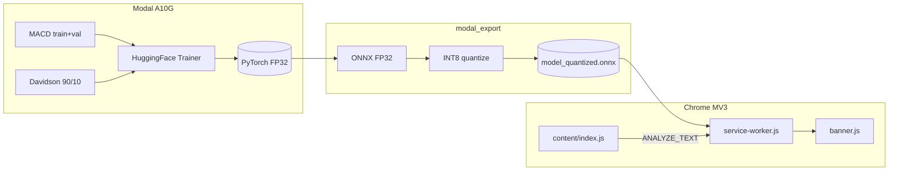

# SurakshaNet — BTP Presentation **PART B** (Slides **16–34** + appendices)

**Continues from:** `REPORTS/BTP_PRESENTATION_FINAL_PART_A.md` (Slides **1–15**).  
**Master copy (full deck):** `REPORTS/BTP_PRESENTATION_FINAL.md`.

---

## Notebook LM batching (15-slide limit)

This file contains **19** numbered slides (16–34) plus appendices. If your tool allows **only 15 slides per run**:

1. **Batch 1:** Slides **16–30** (15 slides) — generate PDF first.  
2. **Batch 2:** Slides **31–34** + **Appendices A–C** — generate PDF second; merge after Part A PDF + Batch 1.

---

## Numerics rule (same as Part A)

- Poster values everywhere **except** Slide **14** (in Part A) quantization table — **−0.28 pp** from **`REPORTS/final_report.md`**.

---

## Graphics in Part B

| Slide(s) | Asset |
|----------|-------|
| **18** | *(optional)* HotCRP MobiSys acceptance email |
| **26** | `REPORTS/WhatsApp Image 2026-05-10 at 14.58.41.jpeg` |
| **27** | `REPORTS/WhatsApp Image 2026-05-10 at 15.00.32.jpeg` |
| **28** | `REPORTS/WhatsApp Image 2026-05-10 at 15.12.38.jpeg` |
| **29** | reuse `paper2.png` Stage 2 or flowchart *(build)* |

---

## Master layout defaults

**Slide size:** 16:9 · **Title:** 28–32 pt bold · **Body:** 18–22 pt · **Figures:** proportional, centered.

---

## Slide 16 — Runtime performance (poster)

**Title:** `Runtime Performance on the Edge Stack`

**Callouts:**

```
28 ms          ~89 MB           INT8 ONNX
median         RAM footprint    WASM MV3
latency        (poster)
```

**Bullets:**

```
• Median inference latency **28 ms** (poster / deployment measurements)
• RAM footprint **~89 MB** (poster)
• Real-time classification without remote model download during inference
```

---

## Slide 17 — Forensic & privacy

**Title:** `Forensic Evidence & Privacy`

**Bullets:**

```
• DOM snapshots & millisecond-precision timestamps
• Chain-of-custody style logs for incident review
• **AES-256** local encryption of stored evidence
• Export path toward **court-admissible** incident reporting (PDF workflow)
• Raw chat content not uploaded for inference — weights ship inside the extension package
```

---

## Slide 18 — MobiSys acceptance

**Title:** `Peer Recognition`

**Bullets:**

```
• **MobiSys ’26 — Posters track** (ACM)
• Poster accepted — **Submission #19**
• Title: **Poster: SurakshaNet: Privacy-First, Edge-Deployed Multilingual Abusive Language Detection**
```

**Graphic:** HotCRP acceptance email — **right ~55%**; bullets **left ~42%**.

---

## Slide 19 — Limitations

**Title:** `Limitations & Ethics`

**Bullets:**

```
• Binary abusive vs non-abusive — severity grading not modeled
• Training-data bias & dialect coverage gaps may skew predictions
• Confidence percentage is model softmax output, not a legal judgment
• Continuous evaluation & user studies remain future work
```

---

## Slide 20 — Conclusion

**Title:** `Conclusion`

**Bullets:**

```
• MACD-aligned MiniLM pipeline with poster headline metrics (Hindi-only, Hindi+English, deployment figures)
• **76%** smaller weights (**471 MB → 113 MB**) with measured **−0.28 pp** Test-A drop after INT8 (REPORTS)
• MV3 extension + WASM inference + forensic hooks; **MobiSys ’26** poster acceptance
```

---

## Slide 21 — Thank you

**Title:** `Thank You`

```
Questions?

{your emails}

Repository / demo links as approved by your institute
```

---

## Slide 22 — What we implemented (engineering)

**Title:** `What We Implemented (End-to-End)`

**Body:**

```
• Cloud training (Modal A10G): PyTorch fine-tuning on MACD hindi_train + Davidson 90% train; validation ONLY on MACD hindi_val; hindi_test & Davidson 10% never used in modal_train.py.

• Export: FP32 ONNX → static INT8 quantization → tokenizer + config → assets/models/custom-macd-model/

• Browser: MV3 service worker loads INT8 ONNX via @xenova/transformers + ONNX Runtime Web (WASM); content script scans DOM → sendMessage → banner.js; evidence_logger for hashes/screenshots.
```

---

## Slide 23 — Base model

**Title:** `Base Model — sentence-transformers/paraphrase-multilingual-MiniLM-L12-v2`

**Bullets:**

```
• **BERT-style encoder** (12 layers, hidden 384) — MiniLM compact variant
• Pre-trained on **multilingual paraphrase / sentence** objectives — strong short-text representations
• Our head: **AutoModelForSequenceClassification**, **num_labels = 2**
• Loaded via **AutoTokenizer** + **AutoModelForSequenceClassification.from_pretrained** (`training/modal_train.py`)
```

**One-liner:**

```
XLM-R-class models score higher on MACD benchmarks but exceed browser WASM RAM; MiniLM is the deliberate accuracy–footprint trade-off (−1.68 pp vs paper on Hindi-only; ~76% smaller quantized bundle).
```

---

## Slide 24 — Training forward pass

**Title:** `Training-Time Forward Pass (Per Batch)`

**Numbered:**

```
1. Batch → WordPiece tokenizer → input_ids, attention_mask (max_length = 128).

2. MiniLM encoder → logits ∈ ℝ^{batch × 2}.

3. Loss = weighted CrossEntropyLoss(balanced class weights, label_smoothing = 0.1).

4. AdamW + cosine LR + 10% warmup (TrainingArguments).

5. Each epoch: eval on val_ds (**MACD hindi_val only**) — accuracy, macro-F1, precision, recall.
```

**Footnote:** `WeightedTrainer` subclasses Hugging Face `Trainer` (`training/modal_train.py`).

---

## Slide 25 — Validation semantics (critical)

**Title:** `Validation Set — What “Val” Means Here`

```
• Train = MACD hindi_train (20,183) + Davidson train (22,305) → **42,488** rows (shuffled).

• val_df = **macd_val only** — **6,728** rows, **Hindi MACD**.

• Davidson has **no** Trainer validation split — its 10% is **only** for modal_evaluate.py.

• metric_for_best_model = **f1_macro**, load_best_model_at_end = True.

→ Checkpoint selection optimizes **macro-F1 on Hindi validation**; English generalization appears on **held-out** Davidson Test B and combined Test C.
```

**Optional Q&A line:** “English is trained but not used for early-stopping validation.”

---

## Slide 26 — Modal dataset logs screenshot

**Title:** `Training Run — Dataset Construction (Modal Logs)`

**Layout:** Left **48%** bullets; Right **50%** screenshot.

**Numbers:**

```
MACD train:      20,183
MACD val:         6,728   ← Trainer eval_dataset
Davidson full:   24,783
Davidson train:  22,305 (90%)
Davidson test:    2,478 (10% — indices → /vol/davidson_test_indices.json)
Combined train:  42,488
Labels (train):  class 0 → 29,088 · class 1 → 13,400
```

**Graphic:** `REPORTS/WhatsApp Image 2026-05-10 at 14.58.41.jpeg`

**Caption:** `Fig.: surakshanet-train Modal logs — corpus sizes & Davidson index persistence.`

---

## Slide 27 — Epoch-2 validation screenshot

**Title:** `Training Dynamics — Validation Metrics (Example Epoch)`

**Layout:** Screenshot ~70% width.

**Numbers (Epoch 2 example):**

```
eval_loss ~0.407 · eval_accuracy ~0.845 · eval_f1_macro ~0.845 · epoch 2.0 · eval_runtime ~3.63 s · ~1853 samples/s
```

**Note box:**

```
These metrics are **MACD hindi_val during training**, NOT final **hindi_test (Test A)**. Final Test A FP32 accuracy = **84.66%** (`REPORTS/final_report.md`) after full training + evaluate pipeline.
```

**Graphic:** `REPORTS/WhatsApp Image 2026-05-10 at 15.00.32.jpeg`

---

## Slide 28 — FP32 size / parameters screenshot

**Title:** `Model Footprint Before Quantization (PyTorch FP32)`

```
model.safetensors · 448.839 MB · checkpoint dir 465.138 MB · 117,654,530 parameters (all trainable)
```

**Graphic:** `REPORTS/WhatsApp Image 2026-05-10 at 15.12.38.jpeg`

**Caption:** `FP32 artifact before ONNX export / INT8 (poster aggregate size story: 471 MB → 113 MB).`

---

## Slide 29 — Export pipeline

**Title:** `Export Pipeline (modal_export.py)`

**Numbered:**

```
1. Best checkpoint `/vol/checkpoints/pt`
2. Export → ONNX FP32 (~449 MB class per REPORTS)
3. Static INT8 quant → model_quantized.onnx (~113 MB)
4. Sync → `assets/models/custom-macd-model/`
5. `npm run build` → `dist/` extension
```

**Graphic:** Stage-2 bars from **`paper2.png`** or flowchart.

---

## Slide 30 — Browser call chain

**Title:** `Runtime Call Chain — Chrome Extension`

```
DOM mutation → MutationObserver (`src/content/index.js`) → scheduleScan [1200 ms throttle]
→ scanPage() → chrome.runtime.sendMessage({ type: 'ANALYZE_TEXT', text, source })
→ Service Worker (`service-worker.js`) → pipeline('text-classification','custom-macd-model')
→ ONNX Runtime Web WASM → analyzeToxicity() → sendResponse
→ showRedBanner (`banner.js`) → optional logIncident()
```

**Graphic:** Swimlanes (Page | Content script | Service worker | ONNX).

---

## Slide 31 — WASM / env settings

**Title:** `Why These ONNX / WASM Settings?`

```
• env.allowRemoteModels = false — no CDN weights
• env.backends.onnx.wasm.numThreads = 1 — MV3 service worker stability
• env.backends.onnx.wasm.wasmPaths — WASM from packaged assets
• pipeline(..., top_k: null) — scores for both labels
```

---

## Slide 32 — Thresholding & severity

**Title:** `Post-Processing After the Neural Net`

```
• id2label: 0 = abusive, 1 = non-abusive
• Flag if abusive score ≥ 0.65
• Severity HIGH if max abusive score > 0.85 else MEDIUM
• Banner: "Abusive (Hinglish MACD)" + score × 100%
```

---

## Slide 33 — Master figures index (optional)

**Title:** `Figures & Screenshots Index`

| Topic | File |
|-------|------|
| Pipeline | `paper2.png` |
| Live UI | `paper1.jpeg` |
| Loss | `loss_curves.png` |
| Confusion matrices | `confusion_matrices.png` |
| Modal logs | WhatsApp `14.58.41` |
| Epoch eval | WhatsApp `15.00.32` |
| Size/params | WhatsApp `15.12.38` |
| MobiSys | acceptance email |

---

## Slide 34 — Architecture diagram (optional)

Paste into [mermaid.live](https://mermaid.live), export PNG if desired:



---

# APPENDIX A — Five-minute monologue

**Data.** Training uses **hindi_train** + **Davidson 90%**; validation **only hindi_val (6,728)**; **hindi_test** and **Davidson 10%** appear **only** in `modal_evaluate.py` after leakage hashing.

**Model.** Fine-tuned **paraphrase-multilingual-MiniLM-L12-v2** with **balanced weights**, **label smoothing 0.1**, **best checkpoint by macro-F1** on Hindi val.

**Validation vs test.** Epoch screenshots (~84.5% at epoch 2) are **validation**, not **Test A 84.66%** — final metrics come from **held-out evaluate** + ONNX/INT8 comparison.

**Deployment.** Quantized model in **`assets/models/custom-macd-model/`**; inference only in **service worker**; content script **sendMessage** round-trip.

---

# APPENDIX B — Timing

| Block | Slides | ~min |
|-------|--------|-----|
| Part A + story close | 1–21 | ~22 |
| Technical depth | 22–34 | ~15–18 |
| Q&A | — | 5–10 |

**Full deck:** ~35–45 min.

---

# APPENDIX C — Consistency checklist

- [ ] Slide 14 (Part A) uses **−0.28 pp** only — no poster **<0.11%**
- [ ] Slide 27 note: **val ≠ Test A**
- [ ] Combined train **42,488** matches Modal log slide
- [ ] WhatsApp filenames exact (**15.12.38**)

---

_End of Part B._
