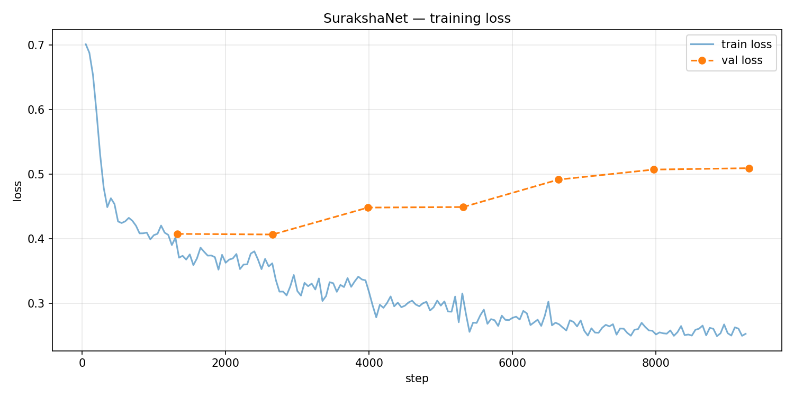
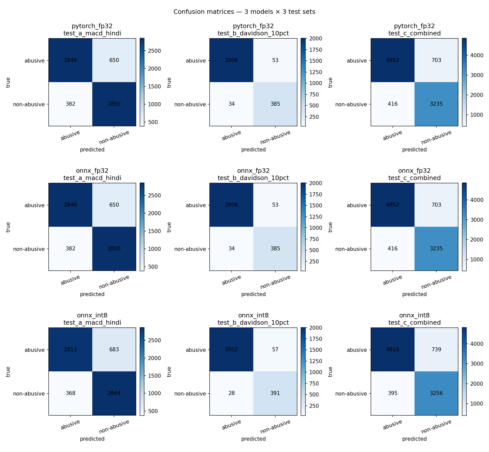
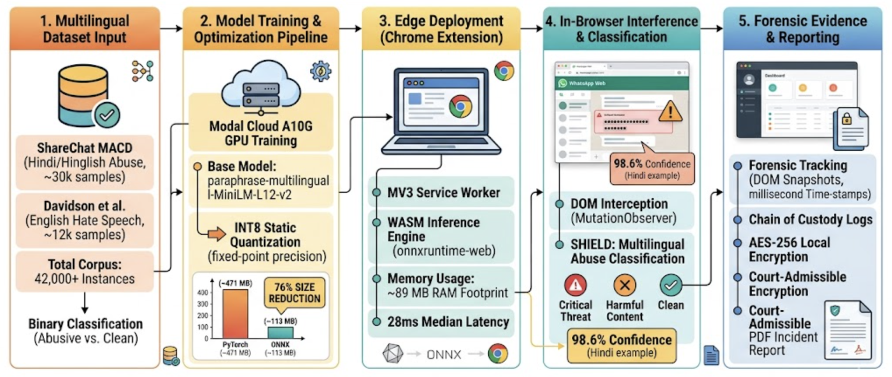
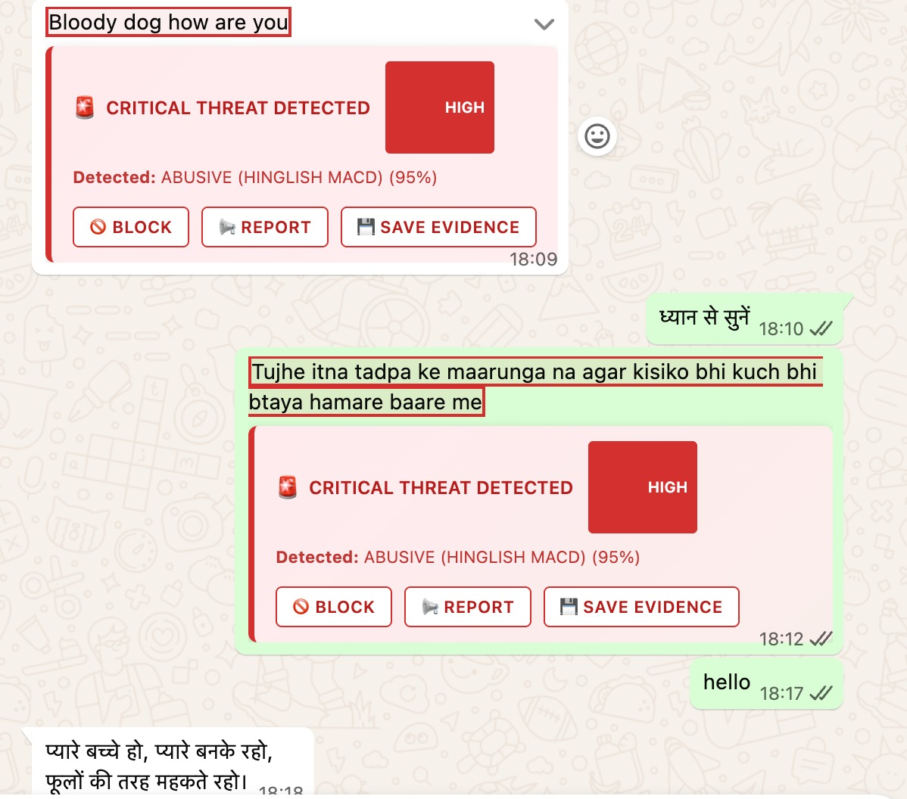

# SurakshaNet — Complete Technical Viva / Examination Prep

One reference for **every** technical detail you may be asked: training math, model architecture, numbers, ONNX/browser pipeline, and end-to-end behaviour. Aligns with `training/`, `src/`, and `REPORTS/`.

---

## Part 1 — Core ML vocabulary (how you should answer)

### What is an **epoch**?

One **epoch** means the optimizer has seen **every training example once** (one full pass over the training set). You used **`num_train_epochs = 7`** (`TRAIN_HPARAMS` in `_common.py`), so the model sees all **42,488** combined training rows **seven times** over (with different shuffling each epoch via `Trainer`).

### Why **7 epochs** — how did you decide?

The codebase fixes **7 epochs** as part of the tuned recipe (documented as the “Improved” config in `_common.py`). **How you defend it:**

1. **Validation curves:** `REPORTS/loss_curves.png` shows training loss decreasing and validation (`eval_loss`) tracked **once per epoch**. You chose **`metric_for_best_model = f1_macro`** and **`load_best_model_at_end = True`** — so the saved checkpoint is **not** necessarily epoch 7; it is whichever epoch had the **best macro-F1 on `hindi_val`**.
2. **Early stopping:** You did **not** use early stopping with patience in code — you run **all 7 epochs** but **reload the best checkpoint** at the end.
3. **Practical answer:** “Seven epochs was chosen after experimentation / standard recipe for this model size and data scale; model selection is by **validation macro-F1**, not by last epoch.”

### What does the **loss curve** tell you?

- **Training loss** (solid line in `loss_curves.png`): average **CrossEntropyLoss** (with class weights + label smoothing) over training batches — should generally **decrease** if learning works.
- **Validation loss** (`eval_loss`, dashed): loss on **`macd_val` only** — if it **rises while train loss falls**, that suggests **overfitting**; your tool **`load_best_model_at_end`** mitigates by picking the best F1 epoch.
- **Important:** Mid-training **val accuracy ~84.5%** (e.g. epoch 2 screenshot) is **not** the same as final **Test A 84.66%** — that comes from **`modal_evaluate.py`** on **`hindi_test`** after training finishes.

### What is a **batch** / **batch size 32**?

Training updates weights after **32 samples** (`per_device_train_batch_size=32`). One **step** = one forward + backward on one batch. **Gradient accumulation** was not enabled (default 1), so **effective batch = 32**.

### What is **learning rate** `3×10⁻⁵`?

Step size for weight updates. With **cosine schedule** and **`warmup_ratio=0.1`**, the LR starts **near zero**, ramps up over **10% of total optimizer steps**, then decays following a **cosine curve** to **~0** by the end — stabilizes early training and fine-tunes gently.

### What is **weight decay** `0.01`?

**L2 regularization** coefficient in AdamW — penalizes large weights to reduce overfitting.

### What is **label smoothing** `0.1`?

Instead of hard targets `{0,1}`, targets are smoothed (e.g. distribute **0.1** mass to wrong class). Reduces **overconfidence** and often improves calibration and generalization.

### What are **class weights**?

`compute_class_weight(..., balanced)` from sklearn on **training labels** gives higher weight to the **minority class** so the loss penalizes mis-classifying underrepresented abuse/non-abuse proportionally. Fed into **`CrossEntropyLoss(weight=...)`** in `WeightedTrainer`.

---

## Part 2 — Base model: what it is and what you did to it

### Full Hugging Face id

**`sentence-transformers/paraphrase-multilingual-MiniLM-L12-v2`**

### Architecture family

- **MiniLM**: distilled / compact **BERT-style** transformer (encoder-only).
- **L12**: **12 transformer layers**, **12 attention heads**, **hidden size 384** (typical MiniLM-L12 config — cite model card if asked exact numbers).
- **Multilingual**: trained on **many languages**; shared subword vocabulary (**SentencePiece** / WordPiece-style tokenizer).
- **Paraphrase objective (pre-training):** originally tuned for **sentence similarity / paraphrase** — produces strong **sentence-level** representations for **short text**, which transfers well to **comment / chat classification**.

### What layers you “used” vs “trained”

1. **Loaded:** Full encoder **stack** (embeddings + 12 encoder layers + pooler if present) + default sequence classification **head** replaced when you call **`AutoModelForSequenceClassification.from_pretrained(..., num_labels=2)`**.
2. **Fine-tuning:** By default **all parameters** are trainable (`Trainer` does not freeze backbone unless you add code — you did **not** freeze). So **gradients flow through all encoder layers** and the **classification head** (linear layer mapping pooled representation → **2 logits**).
3. **Classification head:** Typically a **linear layer** from hidden size **384** to **2** logits (`num_labels=2`). Outputs are **not** probabilities until **softmax** at inference.

### Forward pass (training)

For each batch:

1. **Tokenize** texts: `max_length=128`, padding **max_length**, truncation **`MAX_LENGTH`** from `_common.py` (**128**).
2. **Input:** `input_ids`, `attention_mask` → model → **`logits`** shape **`[batch_size, 2]`**.
3. **Loss:** **`WeightedTrainer.compute_loss`**: **`CrossEntropyLoss`** with **`weight=class_weights`**, **`label_smoothing=0.1`**, comparing logits to integer labels **0 / 1**.
4. **Backward:** PyTorch autograd computes **∂loss/∂θ** for every trainable θ; **AdamW** updates weights.

### What **macro-F1** means

**F1** per class, then **average** — treats both classes equally important vs accuracy which can be dominated by majority class.

### Labels (exact convention)

From `_common.py` / MACD CSV:

- **`0` → `"abusive"`**
- **`1` → `"non-abusive"`**

`id2label` / `label2id` in shipped `config.json` must match.

---

## Part 3 — Data (every important number)

| Item | Value | Meaning |
|------|------:|---------|
| MACD **train** | **20,183** | Hindi training rows |
| MACD **val** (`hindi_val`) | **6,728** | **Only** validation set for `Trainer` |
| MACD **test** (`hindi_test`) | **6,728** | **Held-out** — used **only** in `modal_evaluate.py` |
| Davidson **full** | **24,783** | All English rows loaded |
| Davidson **train** (90%) | **22,305** | Concatenated into training |
| Davidson **test** (10%) | **2,478** | Held-out — indices in `/vol/davidson_test_indices.json` |
| **Combined train** | **42,488** | `macd_train + davidson_train`, shuffled (`seed=42`) |
| Train label counts | **29,088** class 0, **13,400** class 1 | Imbalance → **balanced class weights** |
| **Test A** | **6,728** | MACD Hindi |
| **Test B** | **2,478** | Davidson English |
| **Test C** | **9,206** | Concatenated |

### Critical conceptual question: **Why is validation only Hindi?**

**Code fact:** `val_df = macd_val.copy()` — **Davidson has no validation split** in training. Davidson’s 10% is **evaluation-only**.

**Defence:** Checkpoint selection optimizes **macro-F1 on Hindi validation** (large, stable Hindi slice). English performance is measured **honestly** only on **held-out Davidson test** (Test B) and **combined** (Test C).

---

## Part 4 — Training infrastructure & where artifacts live

### Where training runs

**Modal.com** serverless — **`modal_train.py`** — GPU **`A10G`**, image **`IMAGE`** (PyTorch 2.1.2, transformers 4.36.2, etc. from `_common.py`).

### Where PyTorch checkpoint is saved

- **On Modal volume:** **`/vol/checkpoints/pt/`** (`PT_CHECKPOINT_DIR`)
- Contains at least: **`model.safetensors`** (or `pytorch_model.bin`), **`config.json`**, tokenizer files.
- Your screenshot: **~448.84 MB** weights, **~465 MB** directory**, **117,654,530** parameters.

### What **`modal_export.py`** does (exact pipeline)

1. **Load** FP32 checkpoint from **`PT_CHECKPOINT_DIR`**.
2. **`ORTModelForSequenceClassification.from_pretrained(..., export=True)`** → writes **FP32 ONNX** to **`/vol/checkpoints/onnx_fp32/`** (`model.onnx`).
3. **Quantize:** **`ORTQuantizer`** + **`AutoQuantizationConfig.avx2(is_static=False, per_channel=False)`**  
   - **`is_static=False`** ⇒ **dynamic quantization** (weights quantized; activations quantized at runtime in a dynamic style — check ONNX Runtime docs for exact op behaviour).
   - **`per_channel=False`** ⇒ **per-tensor** quantization granularity (as opposed to per-channel for conv).
4. Output INT8 ONNX: **`model_quantized.onnx`** under **`/vol/checkpoints/onnx_int8/`**.
5. **Local entrypoint** writes bytes into repo: **`assets/models/custom-macd-model/`** including **`onnx/model_quantized.onnx`** plus tokenizer + configs (`EXTENSION_FILES` list in `modal_export.py`).

### Note on wording

Marketing/poster may say “static INT8”; **your export script uses Optimum’s AVX2 config with `is_static=False`** — if examiner is strict, say **“dynamic quantization via Optimum ORTQuantizer with AVX2 config”** and point to `modal_export.py` lines 121–124.

---

## Part 5 — ONNX & quantization (deep technical)

### What is **ONNX**?

**Open Neural Network Exchange** — a portable graph format describing the network as **operators** (MatMul, Softmax, …). **ONNX Runtime** runs that graph efficiently on CPU/GPU with optimized kernels.

### Why FP32 → ONNX?

Same mathematical model, but graph optimized for **inference** (no autograd), deployable outside PyTorch — bridge to **browser** via **onnxruntime-web**.

### What **INT8 quantization** does

Weights (and/or activations per scheme) represented with **8-bit integers** instead of **32-bit floats** → **smaller file**, faster **integer** ops on CPU SIMD (**AVX2** path). **Trade-off:** small numerical error → small accuracy drop (**−0.28 pp** on Test A in your `REPORTS/final_report.md`).

### Your measured sizes (from `REPORTS`)

- PT FP32 weights ~**448.8 MB** → INT8 ONNX ~**112.8 MB** (~**4×** compression).
- Poster narrative **471 MB → 113 MB, 76%** — same story, rounded **pre-export** totals.

---

## Part 6 — Evaluation numbers (what each % means)

| Metric | Where | Meaning |
|--------|-------|---------|
| **86.34%** | MACD paper (XLM-R) | Published Hindi-test accuracy — **different model**, larger |
| **84.66%** | SurakshaNet Test A FP32 | **Held-out `hindi_test`** — fraction of **6728** examples classified correctly |
| **−1.68 pp** | vs paper | **86.34 − 84.66** percentage **points**, not percent of percent |
| **88.01%** | Poster combined Hindi+English headline | Your poster single-number combined setting |
| **84.38%** | Test A INT8 | After quantization |
| **−0.28 pp** | Quantization cost | **84.66 − 84.38** on Test A |
| **Macro-F1 / Precision / Recall** | `modal_evaluate.py` | Standard sklearn definitions on held-out sets |

### Confusion matrix reading

Rows = **true** label, columns = **predicted**. Off-diagonals = **false positives** (predict abusive when not) and **false negatives** (miss abuse).

---

## Part 7 — Browser runtime — exact pipeline when someone sends bad text

**Nothing runs “when they type”** in your design — it runs when **message text appears in the DOM** (WhatsApp loads bubbles asynchronously).

### Step-by-step

1. **Page loads** → **`src/content/index.js`** injects → **`MutationObserver`** on `document.body` watches subtree changes.
2. **DOM changes** (new message bubble) → **`scheduleScan`** (debounced **1200 ms**) → **`scanPage()`**.
3. **`getMessageElements()`** queries selectors (WhatsApp `span[data-testid="selectable-text"]`, tweet text, etc.).
4. For each text node: read **`innerText`**, skip if too short / already scanned (`dataset.surakshaScanned`), dedupe **`scannedTexts`** Set (WhatsApp rebuilds DOM on scroll).
5. **`chrome.runtime.sendMessage({ type: 'ANALYZE_TEXT', text, source })`** — **cross-process IPC** to **MV3 service worker** (`service-worker.js`).
6. **Service worker** (first time): **`initializeModel()`** → **`@xenova/transformers`** **`pipeline('text-classification', 'custom-macd-model')`** loads:
   - **`env.localModelPath`** → extension **`assets/models/`**
   - **`env.allowRemoteModels = false`** → **no Hugging Face CDN**
   - ONNX Runtime **WASM** backend, **`numThreads = 1`**, **`wasmPaths`** set to extension **`assets/`**
7. **`classifier(text)`** runs **forward pass** on INT8 ONNX → returns `[{ label, score }, …]` with **`top_k: null`** → **both** classes scored.
8. **`analyzeToxicity(results)`**: if label is abusive and **`score ≥ 0.65`** → **`isToxic`**, **`maxScore`**, **`severity`** HIGH if **`> 0.85`** else MEDIUM.
9. **`sendResponse`** back to content script → **`showRedBanner(msg, …)`** in **`banner.js`** draws UI (% = **`maxScore × 100`**).
10. If toxic, **`logIncident`** may persist metadata (hashes, etc.) per **`evidence_logger.js`**.

### Why **service worker** not content script for inference?

**Heavy ONNX + WASM**; worker stays alive per MV3 policy; avoids blocking UI thread; **shared model singleton** `classifier`.

---

## Part 8 — Gradient flow (how you explain “how gradients change”)

1. **Forward:** minibatch → logits → **cross-entropy loss** (weighted + smoothed).
2. **Backward:** **`loss.backward()`** (inside Trainer) applies chain rule → gradients for **every trainable parameter** (encoder layers + head).
3. **Optimizer:** **AdamW** adjusts each weight: \(\theta \leftarrow \theta - \eta \cdot \hat{m} / (\sqrt{\hat{v}} + \epsilon)\) with decay — **η** follows cosine+warmup schedule.
4. Over **epochs**, loss landscape explored; **best checkpoint** selected by **validation macro-F1**, not minimum train loss.

---

## Part 9 — Possible examiner questions (rapid bank)

### Training / ML

- **Why MiniLM not BERT-large?** Size / latency / WASM constraints; trade accuracy for deployability.  
- **Why macro-F1 not accuracy for checkpoint?** Class imbalance; F1 balances precision/recall across classes.  
- **What is warmup?** LR ramps from small to target to stabilize early updates.  
- **Difference train loss vs val loss?** Train = optimization target on training set; val = generalization estimate on unseen **Hindi val**.  
- **Data leakage?** `modal_evaluate.py` hashes train texts vs tests — **0 overlap** reported.

### Model

- **How many parameters?** ~**117.65M** trainable (your `size_pt` log).  
- **Sequence length?** **128** tokens max.  
- **Output before softmax?** **Logits** — softmax → **probabilities** summing to 1 per row.

### Quantization / ONNX

- **Why ONNX in browser?** No PyTorch in Chrome; ORT-Web runs optimized graph.  
- **INT8 vs FP32?** Smaller, faster; **−0.28 pp** cost on Test A in your report.

### Extension

- **Remote models disabled?** **`allowRemoteModels = false`** — privacy + offline.  
- **Why WASM threads = 1?** Comment in code: avoid Blob worker issues in SW environment.

### Ethics / limits

- **Binary classifier** — no severity levels in model.  
- **Softmax %** is **model confidence**, not legal truth.

---

## Part 10 — File path cheat sheet

| Stage | Path |
|-------|------|
| Train checkpoint (Modal) | `/vol/checkpoints/pt/` |
| Davidson test indices | `/vol/davidson_test_indices.json` |
| ONNX FP32 (Modal) | `/vol/checkpoints/onnx_fp32/model.onnx` |
| ONNX INT8 (Modal) | `/vol/checkpoints/onnx_int8/model_quantized.onnx` |
| Shipped extension model | `assets/models/custom-macd-model/onnx/model_quantized.onnx` |
| Training script | `training/modal_train.py` |
| Export script | `training/modal_export.py` |
| Evaluate script | `training/modal_evaluate.py` |
| SW inference | `src/background/service-worker.js` |
| DOM scan | `src/content/index.js` |
| Banner UI | `src/content/banner.js` |

---

## Part 11 — One “walk through the full project” paragraph (memorize)

“We **fine-tune** a **multilingual MiniLM** encoder with a **binary classification head** using **MACD Hindi + Davidson English** training data (**42,488** rows), validate each epoch on **MACD hindi_val only** (**6,728** rows), optimize **weighted cross-entropy** with **label smoothing** and **AdamW+cosine LR**, and pick the checkpoint by **validation macro-F1**. **Held-out** evaluation on **hindi_test** and **Davidson 10%** shows **84.66%** Test A FP32 accuracy. We **export** to **ONNX FP32**, **quantize** to **INT8 ONNX** with **Optimum’s ORT quantizer**, ship **`model_quantized.onnx`** in the extension, and run inference in the **MV3 service worker** via **ONNX Runtime Web WASM** and **Transformers.js**, triggered by a **MutationObserver** when chat DOM updates — **no remote model download**.”

---

## Part 12 — Every figure & screenshot: what you see, what you conclude

Below, images use paths **relative to this file** (`REPORTS/`). In editors that render Markdown, you should see the picture; otherwise open the file path next to the caption.

---

### A. Training loss curves — `loss_curves.png`

**What it shows**

- **Solid / noisy line (train):** `loss` logged every **50 steps** (`logging_steps=50` in `TrainingArguments`) — **training CrossEntropyLoss** (weighted + label-smoothed) on **mini-batches** of the **42,488** training rows.
- **Dashed line with markers (val):** `eval_loss` computed **once per epoch** on the full **`macd_val`** set (**6,728** rows) — same loss definition but **no gradient update**.

**What you can conclude**

- If **train loss** trends **downward**, the optimizer is reducing error on the training set.
- If **val loss** flattens or **rises** while train loss still drops → **overfitting** signal; your safeguard is **`load_best_model_at_end=True`** with **`metric_for_best_model="f1_macro"`** — you **do not** blindly keep the last epoch; you reload the epoch with **best validation macro-F1**, not the lowest loss.

**Where you “stop” (important)**

- Stopping is **not** read off this curve by hand in your pipeline: you run **7 epochs** end-to-end, then **`Trainer`** reloads the **single best checkpoint** by **validation macro-F1**. So the “stop” rule is **algorithmic** (best-F1 epoch), not “I eyeballed the curve and chose epoch 4.”

---

### B. Confusion matrices — `confusion_matrices.png`

**What it shows**

- Grid **3 models × 3 test sets**. Each cell: **count** of examples with row label (true) and column label (predicted). Classes: **abusive (0)** vs **non-abusive (1)** per your `id2label`.

**What you can conclude**

- **Diagonal** = correct predictions; **off-diagonal** = errors.
- **False positives:** predicted abusive, actually non-abusive (harmless content flagged).
- **False negatives:** predicted non-abusive, actually abusive (missed harm).
- Compare **FP32 vs INT8** cells on **Test A**: changes should be **small** if quantization is healthy — matches your **−0.28 pp** Test A accuracy drop.

---

### C. End-to-end pipeline poster — `paper2.png`

**What it shows**

- **Stage 1:** MACD + Davidson → binary task, ~42k+ instances.
- **Stage 2:** Modal A10G training, MiniLM, **76%** size story **471 MB → 113 MB**.
- **Stage 3:** Chrome MV3, WASM, **~89 MB RAM**, **28 ms** median (poster numbers).
- **Stage 4:** WhatsApp + DOM / SHIELD tiers / example confidence.
- **Stage 5:** Forensics, AES-256, PDF report.

**What you can conclude**

- One slide proof of **data → train → compress → deploy → UI → evidence** — use it to narrate the **whole project** without opening code.

---

### D. Live UI demo — `paper1.jpeg`

**What it shows**

- Model flags **English** and **Hinglish** abusive samples with **HIGH** severity and high confidence (e.g. **95%**); **benign Hindi** left unflagged.

**What you can conclude**

- **Multilingual behaviour** in a **real DOM** (extension works on live bubbles).
- The **95%** is **softmax confidence for the abusive class**, not dataset accuracy.
- **Product story:** Block / Report / Save Evidence — ties to forensic slide.

---

### E. Modal dataset log — `WhatsApp Image 2026-05-10 at 14.58.41.jpeg`

**What it shows**

- **MACD train / val** sizes, **Davidson** 90/10 split, **combined train 42,488**, label histogram **{0: 29088, 1: 13400}**, indices written to volume.

**What you can conclude**

- **Reproducible** data plumbing — matches `modal_train.py` printouts.
- **Class imbalance** (~2:1) justifies **balanced class weights** in loss.

---

### F. Training / eval terminal — `WhatsApp Image 2026-05-10 at 15.00.32.jpeg`

**What it shows**

- **`eval_*` metrics** at a particular **epoch** (e.g. epoch **2.0**): **accuracy ~0.845**, **macro-F1 ~0.845**, **eval_loss**, throughput.

**What you can conclude**

- This is **validation on `hindi_val` during training**, **not** final **Test A** on **`hindi_test`**.  
- **Final** Hindi held-out number for the paper is **84.66%** on **`hindi_test`** from **`modal_evaluate.py`**, after full **7 epochs** and **best checkpoint** logic.

---

### G. PyTorch size / params — `WhatsApp Image 2026-05-10 at 15.12.38.jpeg`

**What it shows**

- **`model.safetensors`** ~**448.84 MB**, **117,654,530** trainable parameters, checkpoint dir size ~**465 MB**.

**What you can conclude**

- **Scale** of the **FP32** artifact **before** ONNX/INT8 — answers “how big is the model?” in **parameters** and **disk**.

---

## Part 13 — Epochs vs steps vs “feeding the same data again and again”

### Definitions (use these in the viva)

| Term | Meaning in your project |
|------|-------------------------|
| **Epoch** | One full pass over all **42,488** training examples (each seen **once** in order determined by shuffling). |
| **Step** | One **optimizer update** = one **backward pass** on **one batch** (batch size **32** → **32** examples per step). |
| **Steps per epoch** | \(\lceil 42\,488 / 32 \rceil = 1\,328\) steps (approximately). |
| **Total training steps** | ~**1,328 × 7 epochs ≈ 9,296** steps — matches the order of magnitude of a full-run progress bar like **9296** in your terminal screenshot. |

### Are we “just feeding the same information again and again”?

**Short answer:** The **rows** are the same dataset, but **each epoch is not identical training**:

1. **Shuffling:** `train_df.sample(frac=1.0, random_state=SEED)` — order of batches changes in a controlled way; batches differ epoch to epoch.
2. **Weights change:** After epoch 1, **all parameters** are different, so the **same sentence** produces **different logits** in epoch 2 — the model is **not** re-learning from scratch on a frozen function.
3. **Goal of multiple epochs:** Low loss / high F1 often needs **several passes** so rare patterns and hard negatives are seen enough times; one epoch is usually insufficient for fine-tuning.

So you are **not** “memorizing one pass”; you are **iterative optimization** over the same **fixed** training set with **changing** model parameters.

### How this ties to “where to stop”

- **You do not** manually stop by staring only at the loss curve.
- **You run 7 epochs** (fixed budget).
- **Hugging Face Trainer** saves the checkpoint at the epoch with **best `eval_f1_macro`** on **`macd_val`**, then **`load_best_model_at_end`** restores it — that is your **effective “best epoch”** selection.
- If an examiner asks “why not 10 epochs?” — answer: **recipe / compute / empirical**; you could add **early stopping** with **patience** in future work.

---

_Add this Part 12–13 when rehearsing figure explanation and epoch/step vocabulary._

---

_This document is intentionally exhaustive; trim answers to fit oral exam time._
